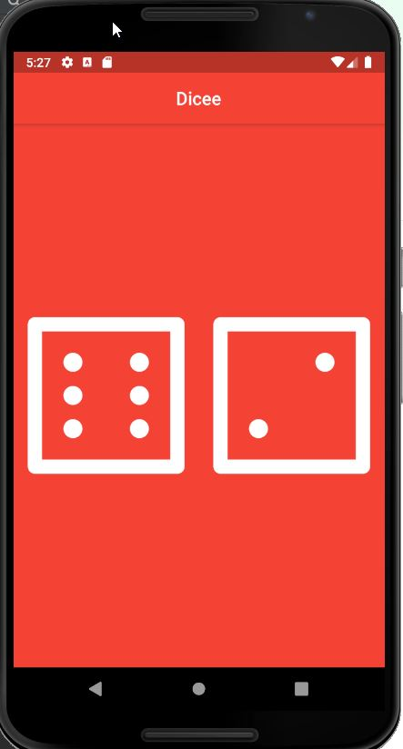

# Dice App
Dice App using Flutter

### Click the Play Button to Roll the Dice
  - Every time the user clicks the play button Dice are rolled
  - changeDice() function is invoked and it generates random numbers

